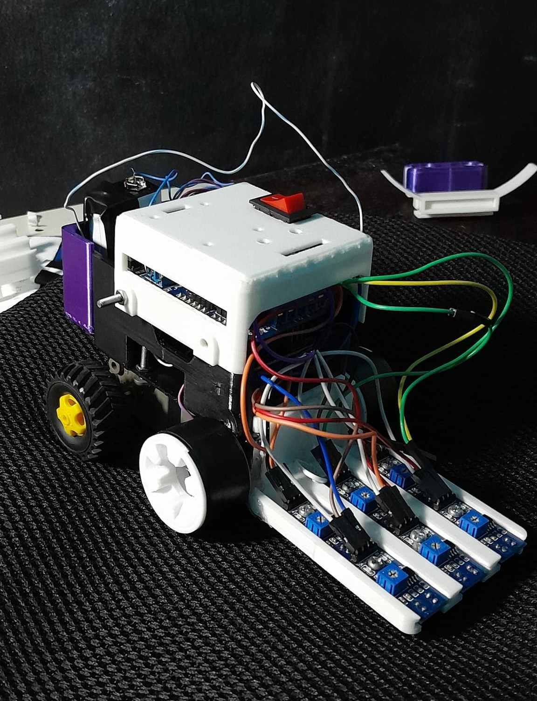

# JIC - Tachibots 2024 Line-Maze Solving Robot

  

## Overview

This repository contains the code and documentation for **JIC**, a line-maze solving robot developed to participate in the **Tachibots 2024** competition. The event was held at the **National Experimental University of Táchira (UNET)** in **San Cristóbal** on **November 21st and 22nd, 2024**.

**JIC** was designed for the **Open Category (Age-Limited)**, where the challenge was to design a robot capable of navigating a labyrinth composed of black lines on a white background. The labyrinth included multiple paths, forks, dead ends, and required the robot to make decisions, backtrack when necessary, and ultimately find the goal.

## Competition Description

> **Open Category (Age-Limited):**
>
> Your robot moves and finds multiple paths. Where should it go? Left, right, or forward? The decision is not easy, but your robot must try a path, and if it is wrong, you have to turn around and move on another path. In the end, the goal awaits you, and with it, the honor of having solved one more labyrinth.

## Technical Specifications

### Physical Characteristics

| Characteristic | Unit | Value |
|----------------|------|-------|
| Mass           | kg   | *To be updated* |
| Length         | cm   | 19    |
| Width          | cm   | 10.5  |
| Height         | cm   | 9.5   |

### Participation Category

- [ ] **Children (6-12 years):** Line-following robots
- [ ] **Youth (13-18 years):** Line-following robots with forks
- [x] **Open (no age limit):** Line-following robots in mazes

### Mechanical System

- **Components:**
  - **2 DC Motors with Gearboxes**
  - **Chassis - Case for Arduino and Motor Shield**
  - **Battery Holder**
  - **IR Sensor Holder**
  - **Cover with Space for Extra Sensors and Power Button**

- **Images:**

  - **Chassis - Case for Arduino and Motor Shield:**
  
    

  - **Battery Holder:**
  
    

  - **IR Sensor Holder:**
  
    

  - **Cover and Space for Extra Sensors and Power Button:**
  
    

### Power Supply

- **Battery:** 9V 250mAh battery with an approximate charge of 3 hours for optimal operation.

### Electronic System

- **Microcontroller:** Arduino Uno R3
- **Motor Driver:** Shield Motor V1 Driver L293D
- **Sensors:** Six TCRT5000 Infrared Sensors
  - **Arrangement:**
    - Placed in two rows:
      - **Front Row:** Three sensors (left, center, right) approximately 2 cm apart.
      - **Rear Row:** Three sensors (left, center, right) approximately 3 cm behind the front row.

### Control System

- **Algorithm:** PID Controller with conditional logic for decision-making at intersections.
- **Code Repository:** [https://github.com/AlbaCastillo/tachibots-line-maze-solver](https://github.com/AlbaCastillo/tachibots-line-maze-solver)

## Software Overview

- **Programming Language:** C++ (Arduino IDE)
- **Control Algorithm:** Proportional-Integral-Derivative (PID) control with enhancements for handling forks, intersections, and recovery mechanisms.
- **Modular Code Structure:** The code is modularized into functions for readability and maintainability.

## Developers

- **Team Members:**
  - [**Alba Patricia Castillo Gimenez**](https://github.com/AlbaCastillo)
  - [**José Daniel Chacón Gómez**](https://github.com/josedanielchg)

- **Design and 3D Printing:**
  - [**Alba Patricia Castillo Gimenez**](https://github.com/AlbaCastillo)

## Acknowledgments

- **Tachibots 2024 Organizers:** Thank you for hosting an inspiring competition that challenges participants to innovate and learn.
- **UNET:** For providing the venue and support for the event.

---